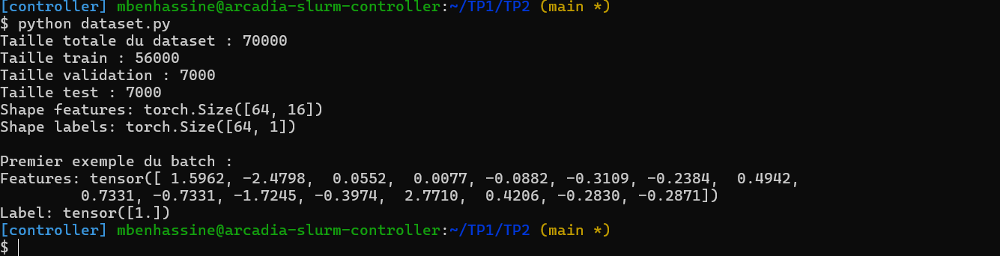
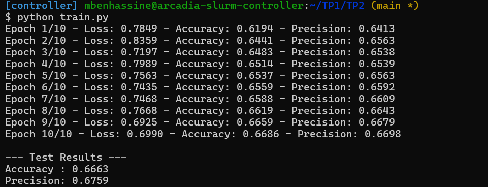
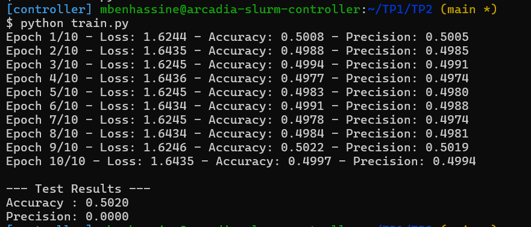
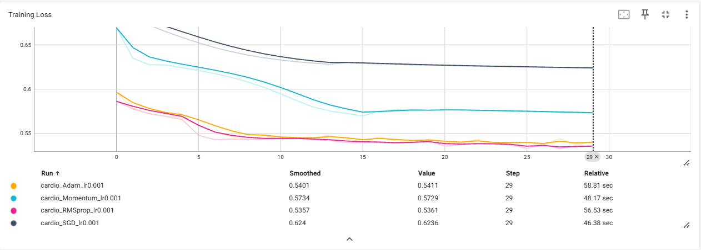
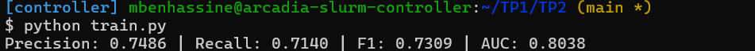

# TP2 – Régularisation, optimisation et métriques
Nom : Mabahej Ben Hassine


## 1. Création d'un dataset personnalisé



La taille du dataset après `drop_duplicates` est de **70 000 échantillons**.

Le dataset est ensuite divisé en :
- **56 000** échantillons pour l'entraînement (80 %)
- **7 000** pour la validation (10 %)
- **7 000** pour le test (10 %)

La forme d'un batch est :
- Features : `torch.Size([64, 16])`
- Labels : `torch.Size([64, 1])`
### Question 1 – Pourquoi `StandardScaler` sur tout le dataset est-il une mauvaise pratique ?

C’est du **data leakage** (fuite de données). Le `StandardScaler` utilise la moyenne et l’écart-type de tout le dataset, y compris les données de validation et de test.

La bonne pratique est de **séparer d’abord** le dataset en train / validation / test, puis de faire le `fit` du scaler **uniquement sur le train** et d’utiliser `transform` sur la validation et le test.

### Question 2 – Dataset trop volumineux pour la RAM

On utiliserait **`torch.utils.data.IterableDataset`**. Il permet de lire les données **progressivement**, par morceaux, sans charger tout le dataset en mémoire.
## 2. MLP et régularisation L1 / L2
### Question 3 – `l1_lambda = 0.1` et `l2_lambda = 0`
avant modificatio de l1 l2


apres modification 



Avec `l1_lambda = 0.1` et `l2_lambda = 0`, on observe que l'apprentissage ne progresse presque pas. La loss reste autour de `1.62–1.64` et la précision reste proche de `50 %`. Sur le test, on obtient une accuracy de `50.20 %` et une précision de `0 %`.

En comparaison, avec une régularisation plus faible, la précision atteint environ `66.86 %` sur l'entraînement et `66.63 %` sur le test.

Une régularisation L1 trop forte pénalise fortement les poids et les pousse vers zéro. Le modèle devient alors trop contraint et n'arrive plus à apprendre correctement les données. C'est le **sous-apprentissage (underfitting)**.
### 1. Régularisation L2

L'argument `weight_decay` de l'optimiseur permet d'appliquer automatiquement la régularisation L2.

```python
optimizer = optim.SGD(model.parameters(), lr=0.01, weight_decay=l2_lambda)
```
### 2. Différence L1 / L2

- **L1** (somme des valeurs absolues) : son gradient a une norme constante, donc elle pousse de nombreux poids à devenir exactement **0**. Elle produit un réseau **parcimonieux** et permet une forme de sélection de variables.

- **L2** (somme des carrés) : son gradient est proportionnel au poids, donc elle réduit les poids de façon proportionnelle sans les annuler. Les poids restent petits mais généralement **non nuls**, ce qui rend le modèle plus lisse.
## 3. Comparaison des optimiseurs et TensorBoard


### Capture TensorBoard



### Question 6 – Optimiseur qui converge le plus vite initialement

RMSprop, juste devant Adam (dès la première epoch, environ 0.587 pour RMSprop et 0.597 pour Adam, contre plus de 0.67 pour SGD et Momentum). Les deux adaptent le pas pour chaque paramètre, donc ils descendent plus vite.

### Question 7 – SGD vs Momentum

Le momentum garde en mémoire les gradients précédents, ce qui accélère la descente et lisse la trajectoire. Sur la courbe, Momentum descend beaucoup plus vite que SGD (0.5729 contre 0.6236 à la fin).

## 4. Analyse des métriques



### Question 8 – Définitions

- **Précision** = TP / (TP + FP) : parmi les patients prédits malades, la proportion qui l'est réellement.
- **Rappel** = TP / (TP + FN) : parmi les patients réellement malades, la proportion détectée par le modèle.

### Question 9 – Précision ou rappel en contexte médical ?

On privilégie plutôt un **fort rappel**. Un faux négatif (patient malade non détecté) peut retarder une prise en charge et avoir des conséquences graves, alors qu'un faux positif conduit surtout à des examens complémentaires, moins coûteux. On ne néglige pas pour autant la précision : trop de fausses alertes surchargent le système de santé. On peut ajuster le seuil (en dessous de 0.5) pour arbitrer entre les deux.

### Question 10 – Intérêt de l'AUC

Précision, rappel et F1 dépendent d'un **seuil fixe** (0.5). L'aire sous la courbe ROC est **indépendante du seuil** : elle évalue la capacité du modèle à **classer** les patients (probabilité qu'un malade tiré au hasard reçoive un score plus élevé qu'un sain). Elle permet de comparer des modèles sans fixer de seuil et de choisir ensuite le seuil de fonctionnement sur la courbe ROC selon le compromis rappel/précision souhaité.
